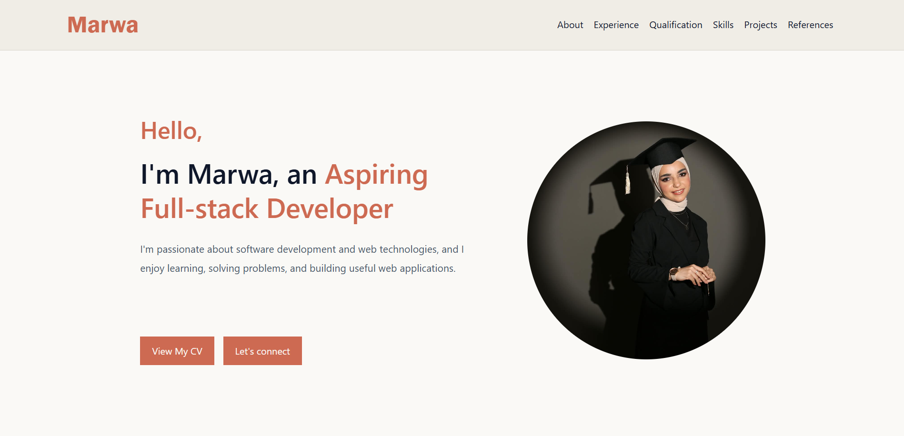

# Marwa | Personal Portfolio

A responsive personal portfolio website built to showcase my background, skills, and projects as an aspiring full-stack developer.
## Live Demo
[Click here to view my portfolio](https://marwam5.github.io/My-Portfolio/)

## Preview



## About

This portfolio highlights my journey from a Computer Information Systems graduate to a full-stack development trainee. It includes my education, hands-on training, technical skills, and the projects I've built so far.

## Sections

- **Hero** — Introduction with name, role, profile photo, and a link to my CV
- **About** — Background, education, and current focus
- **Experience** — Training programs and hands-on learning
- **Qualification** — Educational background and completed programs
- **Skills** — Soft skills and technical skills
- **Projects** — Featured projects with tech stack used
- **References** — Contacts who supported my learning journey
- **Footer** — Contact details and social links

## Built With

- **HTML5** — page structure and semantic markup
- **CSS3** — custom styling, layout, and responsive design (Flexbox)
- **[Bootstrap 5.3.8](https://getbootstrap.com/)** — responsive navbar,footer components


## Responsive Design

The layout adapts across breakpoints for desktop, tablet, and mobile screens, so all sections remain readable and well-structured on any device.

## Project Structure

```
portfolio/
├── images/
│   ├── marwa2.jpeg
│   ├── pro-img1.jpeg
│   └── pro-img2.jpeg
│   └── screenshot3.png.jpeg
├── index.html
├── style.css
└── README.md
```

## Getting Started

To run this project locally:

1. Clone the repository
   ```
   git clone https://github.com/MarwaM5/My-Portfolio.git
   ```
2. Open `index.html` in your browser — no build tools or dependencies required.

## Contact

- **Email:** albadarnehmarwa@gmail.com
- **LinkedIn:** [marwa-albadarneh](https://www.linkedin.com/in/marwa-albadarneh)
- **GitHub:** [MarwaM5](https://github.com/MarwaM5)

## License

This project is for personal portfolio use.